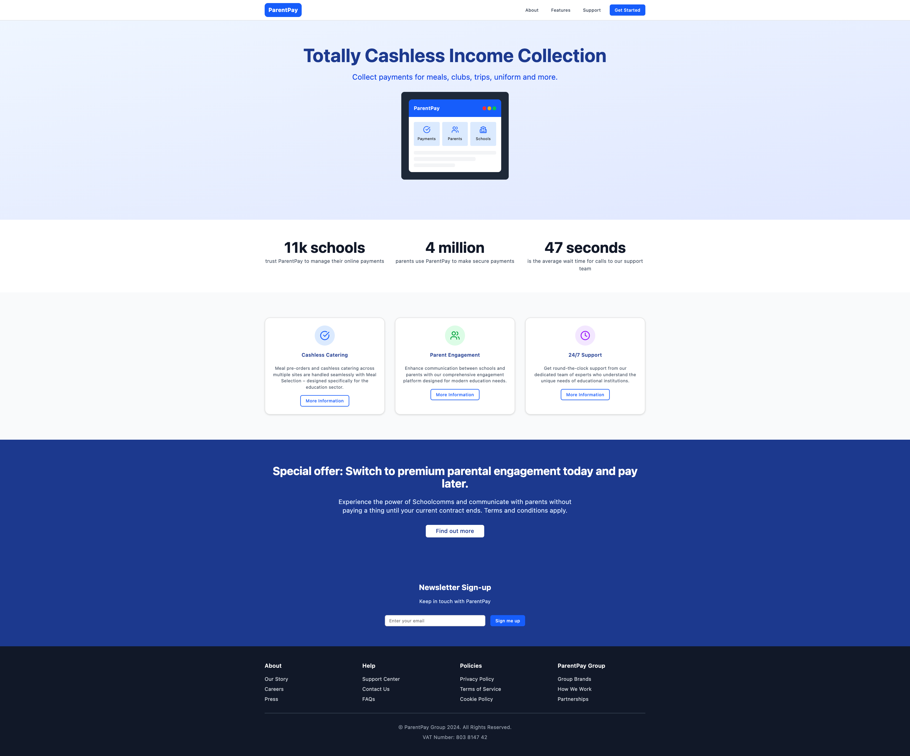

# ParentPay Website Template

This is a complete website template based on the ParentPay website design. The template includes both a simple HTML/CSS/JS version and a modern React version.

## Demo
Here's a quick look at the web application:

## Features

- **Responsive Design**: Works perfectly on desktop, tablet, and mobile devices
- **Modern UI Components**: Uses shadcn/ui components for a professional look
- **Clean Code Structure**: Well-organized and commented code
- **Accessibility**: Follows web accessibility best practices
- **Performance Optimized**: Fast loading and smooth animations

## File Structure

### Simple HTML Version
- `parentpay_html_structure.html` - Complete HTML structure
- `style.css` - CSS styling with responsive design
- `script.js` - Basic JavaScript functionality

### React Version (Recommended)
- `parentpay-template/` - Complete React application
- Modern build system with Vite
- Tailwind CSS for styling
- Pre-configured with shadcn/ui components

## Key Design Elements

1. **Header Navigation**: Clean navigation bar with responsive mobile menu
2. **Hero Section**: Eye-catching hero with animated device mockup
3. **Statistics Section**: Trust-building statistics display
4. **Features Section**: Card-based feature showcase
5. **Call-to-Action**: Prominent CTA sections
6. **Newsletter Signup**: Email collection form
7. **Footer**: Comprehensive footer with organized links

## Color Scheme

- Primary Blue: #2563eb (Blue-600)
- Dark Blue: #1e40af (Blue-800)
- Navy: #1e3a8a (Blue-900)
- Light Blue: #dbeafe (Blue-100)
- Background: #f8fafc (Slate-50)

## Typography

- Clean, modern sans-serif fonts
- Proper hierarchy with varied font sizes
- Excellent readability across all devices

## Getting Started

### HTML Version
1. Open `parentpay_html_structure.html` in a web browser
2. Customize content, colors, and images as needed
3. Replace placeholder images with your own assets

### React Version
1. Navigate to the `parentpay-template` directory
2. Run `npm install` to install dependencies
3. Run `npm run dev` to start the development server
4. Open http://localhost:5173 in your browser
5. Customize components in the `src` directory

## Customization Tips

1. **Branding**: Replace "ParentPay" with your business name
2. **Colors**: Update the color scheme in CSS/Tailwind config
3. **Content**: Replace all text content with your business information
4. **Images**: Add your own images to the assets folder
5. **Features**: Modify the feature cards to match your services

## Deployment

### HTML Version
- Upload files to any web hosting service
- Ensure all file paths are correct

### React Version
- Run `npm run build` to create production build
- Deploy the `dist` folder to your hosting service
- Compatible with Netlify, Vercel, GitHub Pages, etc.

## Browser Support

- Chrome (latest)
- Firefox (latest)
- Safari (latest)
- Edge (latest)
- Mobile browsers

## License

This template is provided as-is for educational and commercial use. Feel free to modify and adapt it for your business needs.

